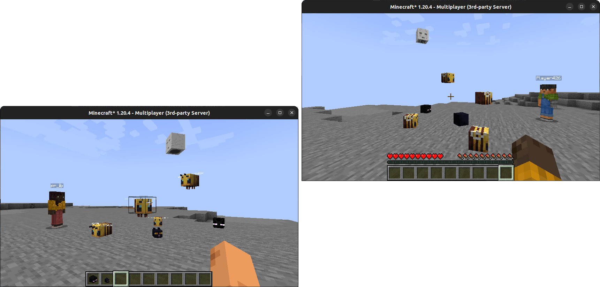

## Headed Rewritten
A better and vanilla-compatible version of Headed.

### What does Headed Rewritten do?
#### Client
Mainly, it changes the rendering of certain player heads to look like new blocks. Here's an example with Headed Rewritten (left) and vanilla (right):

Additionally, it adds a Creative item group with all the added heads.

#### Server
If Headed Rewritten is installed on the server, players with Headed Rewritten installed will see more accurate hitboxes (if it isn't installed, the head hitboxes will have a minimum size of 8x8x8 to avoid glitches).

Also, adding Headed Rewritten to a server will make mobs killed by a charged creeper drop their heads.

### Developers
#### Client
To add a head to the client (for rendering), call `TextureToHeadMap.addHeadNotInGroup()`. The first parameter is the texture whose head will be replaced (the string in `Properties:{textures:[{Value:"String"}]}` is JSON encoded in Base64, so you'll have to decode that in order to get the texture).

You can call `HeadedHead.toStack()` if you want a stack of the head. `TextureToHeadMap.addHeadNotInGroup()` returns a `HeadedHead`.

#### Server
To add a head to the server (for easier creation of a stack through `HeadedServerHead.stack()`, `HeadedServerHead.entry()` and `HeadedServerHead.entryBuilder()`), you can call `TextureToServerHeadMap.addHead()`.